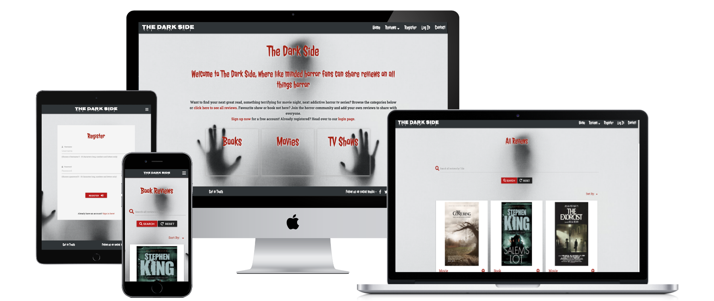
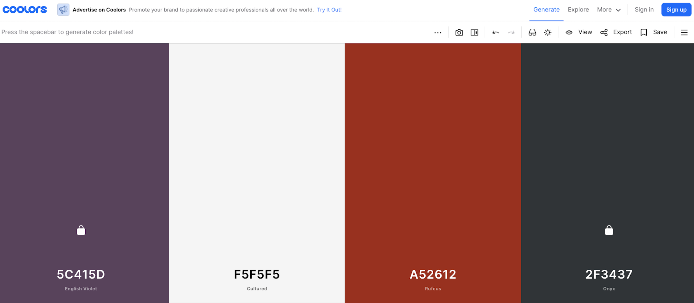
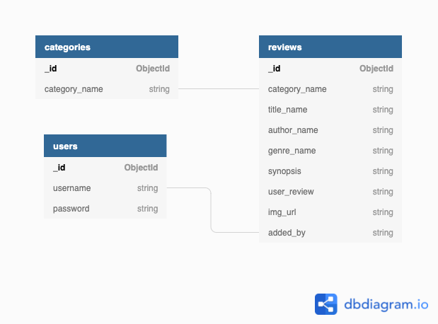

# The Dark Side



View the live website [here](https://the-dark-side.herokuapp.com/).

---

The Dark Side is a review site for all things horror related - books, movies and tv shows. Users can read reviews other horror fans have uploaded and if they wish, they can join in the horror community by creating an account and adding their own reviews. 
___
## Contents
* [UX](#UX)
* [Database](#database)
* [Features](#features)
* [Technologies Used](#technologies-used)
* [Testing](#testing)
* [Deployment](#deployment)
* [Credits](#credits)
___
## UX

### Project Goals

This site is aimed at fans of the horror genre and any potential fans that may be interested in discovering books, movies and tv shows recommended by other fans. 

As a site owner, I want to provide a clear, easy to navigate, intuitive site that users will enjoy visiting and find everything they want easily. I want to give access to reviews so users can read the info and navigate through much of the site content without having to create an account first. I also want to encourage users to engage more with the site and add their own title and reviews to share with the horror fan community. They do this by creating a private secure account so they can upload their own reviews, and have control over content they have added in the future with the ability to update or delete any reviews they have added. 


### User Stories

* As a user, I want to find a site that reviews books, movies and tv shows specifically in the horror genre. 
* As a casual user, I want to be able to navigate the site easily and read reviews to help me decide what to watch or read next, I want access to this information without having to create an account, so I can then decide if I wish to engage and add reviews of my own.
* As a frequent user, I want to be able to create a profile so that I can add reviews of my own to share with other horror fans and users of this site.
* As a user, I want to be able to search the database easily to find any specific reviews. 
* As a user, I want to be able to easily log in to my account so I can see what reviews I have added previously and be able to update or delete them.
* As a user, I want to be able to contact the site with any queries I may have.
* As a user, I want to follow this site on any social media they may have.


### Wireframes

* [Home page](wireframes/home-page.pdf)
* [Reviews page](wireframes/reviews-page.pdf)
* [Register page](wireframes/register-page.pdf)
* [Log In page](wireframes/log-in-page.pdf)
* [My Account page](wireframes/my-account-page.pdf)
* [Add Review page](wireframes/add-review-page.pdf)
* [Contact page](wireframes/contact-page.pdf)

### Design

#### Overall Design

* The aim with the design of this project is to present the user with a clear, easy to navigate, visually appealing website. With the theme of the website being quite specific to the horror genre, I decided to go with the overall color scheme of using red, black, white and grey to suport this theme. With the home page, I chose to keep it quite stark with the focus mainly on the visual of the background image and all the elements on the page designed around this image. From there, it is easy for the user to navigate the site based on what actions they wish to take. 
* I chose to use Materialize CSS for much of the site layout, in particular, their Navigation Bar, Cards, Footer, Forms and Modal components. Overall, it provides a good user-friendly, responsive structure to the website.
* For the reviews themselves, I chose to use the Materialize card reveal to present the reviews to the user. Using images relevent to the title makes for a better user experience and overall appeal of the content. 

#### Images

The main background image which I decided to use across all the pages was carefully chosen to provide a visually arresting image without distracting from the content on the page. It lends itself well to the overall color scheme of the site and allows the content to become the main focus around it. It was chosen to provide an other-worldly, ghost-like effect to convey the content of this site. 

With the images in the reviews, allowing users to provide links to images with their reviews adds to the visual appeal and makes for a better user experience. I decided to make this an optional part of the add review section if users preferred not to have to search for images with their review. As a back-up I have included a simple image that will load if no image url has been provided by the user. 

#### Color scheme
I used [coolors.co](https://coolors.co/) to generate a color scheme for the website. 
Initially, I planned on using a 4th color but found overall, it worked better keeping it to the overall red, black and white scheme.




#### Typefont

I chose the fonts based on the overall horror theme of the site. Nosifer was used for the logo only to give this more emphasis and attention. Jolly Lodger was chosen as the main themed font for headings, nav bar and footer content and some of the catgeory headings on the reviews. I then chose the Roboto font for the remainder of the content for more clarity and ease of reading for the user. All of the above fonts were selected from Google Fonts. 

#### Note about Wireframes
The final design has differed from the wireframes based on what I felt worked better in terms of user experience as I was going through the process of building each page. Instead of one reviews page, I also opted to have seperate pages for each category so that on the home page, the user can chose to just look at book reviews, or just movie reviews etc., as well as the option to look at all the reviews on the site together. The layout of the reviews and way the content is displayed on each card is also something that I changed as the design in the wireframes did not work well with the content and the way I wanted to present the content to the user. I then matched the profile page to present the content in the same manner as the reviews page as anything else would be confusing to the user. I also added a modal to confirm if the user is sure they wish to delete a review. This was not specifically drawn up in the wireframes, but would always be a key feature that a user would expect before fully deleting any information they have previously created. 
I also chose to replace the Genre field with Ratings as I felt sub genres within the horror domain would be too confusing and not provide value to the content. 

[Back to Contents](#contents)
___
## Database 

I used MongoDB as the database for this project, as a non relational, document database, it gives more flexibility to this type of site. 
I used dbdiagram.io when designing the database schema that would best facilitate this project. I based my schema on using 3 collections - 'users', 'categories' and 'reviews'.
* Database schema:



* A note from the above design, I decided against making use of a 'Genre' Field and instead added a 'Rating' which I felt provide more value to the website and a better UX.

[Back to Contents](#contents)
___
## Features
### Existing Features

* Across the site: 
    + Navigation bar with logo (linked back to home page), links to home page, register an account, log in, contact page and reviews with a dropdown to choose from books, movies, tv shows or all reviews. These links are visible to the casual user. Once a user has registered/logged in, the links change from Register & Log in options, to My profile, Add review and Log out. 
    + Footer with links to social media (this will open a new tab to the main homepages of each social media platform as this website is only created for the Code Institute Milestone 3 project and so does not have live social media pages) & link to our contact page. 
    + Use of Flash messages to update the user when an action has been taken, eg adding a review, logging in, logging out etc.
    + Fully responsive to ensure a good user experience on all devices. 

* Home Page
    + Content area with explanation of what the site is about and what users can do once an account is created along with links to the register & log in pages, followed by simple box links to the 3 main categores of reviews on the site - books, movies, tv shows. 
    

* Reviews Pages
    + Four pages for the user to choose from, all with consistent styling. Book reviews page shows only reviews in the 'Book' category, Movies shows only Movie category reviews and TV Show reviews page only brings up the TV Show reviews. Or the user can see all the reviews on the website, all categories showing. 
    + Search Feature - On each page there is a search option at the top which clearly shows the user they can enter text to search through the website by Title name and shows any results matching the user's input, or display a message that no results were found. 
    + Sort Feature - On each page, I have also provided the 'Sort By' option. This is in the form of a dropdown and provides the user with two options to choose from: Sort by Title in alphabetical order, A-Z; or Sort by Rating (this is set-up to show the highest rated first, lowest rated last) and this is sorted based on the number of stars the user has given to the title they have reviewed. If no rating has been added, this is noted within the review and will display last in this sort feature. 
    + Reviews are in card reveal format, they show the image associated with the review, the category and title name. The book category also shows the Author name. An arrow up icon is used to convey to the user they can click here for more information to be revealed. On clicking, the synopsis, review, rating and added by information is revealed. A click on the arrow down will close the card window again. 

* Add Review Page   
    + For registered and logged in users, this page allows them to create their own review. It is laid out in form format, with the Author field hidden once Movie or TV Show has been selected as it is not a relevent field other than in Books. Included is an option to provide a link to an image url address, this is optional which is made clear to the user. There is a character limit to cap the content. Keeping the reviews and synopses to a certain length provides for a better user experience for the aims of this particular site.
    + On clicking submit, it returns the user to their profile page with the review they have added showing. 

* Profile Page
    + For registered and logged in users, this page shows any reviews they have created and submitted to the site. The reviews show edit and delete buttons so the user can perform these actions as they wish and will be redirected to the edit review page or a confirm delete modal will display if the delete option is chosen. An add review button is also displayed here. 
    + If no reviews have been added by this user, a message will display to encourage the user to add a review. 

* Edit Review Page
    + Form is consistent with the Add Review form to ensure ease of use for the user, it is prefilled with all the details of the relevant review so the user can see what needs to be changed easily. 

* Register Page/ Log In Page/ Contact Page
    + Same format used across these pages with the form on each containing clear, concise guidance for the user. 
    + Once registered or logged in successfully, the user will be redirected to their profile page. 
    + Once the contact form has been submitted, user will see a message letting them know their form has been successfully submitted, and will refresh the page with a blank form. 

### Features to implement in the future

In the future, there are a number of features I would like to implement to provide more value to the user: 
* Pagination would provide a better user experience as the amount of reviews increase. This would be the most important feature that I would add next outside of the project assessment timeline.
* A rating system that all registered users can rate any title not just the ones they have created and display a count of those ratings, either based on stars as the rating currently is or upvotes
* Ability for registered users to make a 'favourites' list, so they can save titles to this list to remind them what to watch or read next
* Ability for registered users to add their own review to a title already in the database that another user has created, rather than having to create a full new title to review. 
* Ability for registered users to delete their account. 
* Add further admin capabilites such as being able to delete a user. 
* Add an event category and expand the site to include events such as local horror movie screenings, conventions or any further community events that would be of interest to the horror fans and allow registered users to add events.
* As detailed under the Lighthouse testing in TESTING.md, a more efficient method of dealing with user uploaded images in terms of resizing and optimizing would be a benefit to improve ux on this site. I would like to add this in the future.
* Note: I would add further validation to the contact form in the future (such as email.js) but as this was covered in my previous project, I chose to focus more on the data side of this project and ensure the CRUD functionality was my priority within the time constraints of the project.

[Back to Contents](#contents)
___
## Technologies Used
#### Languages
* [HTML](https://en.wikipedia.org/wiki/HTML)
* [CSS](https://en.wikipedia.org/wiki/CSS)
* [JavaScript](https://en.wikipedia.org/wiki/JavaScript)
* [Python3](https://en.wikipedia.org/wiki/Python_(programming_language))

#### Programs, Frameworks, Libraries, Resources
* [Jinja](https://en.wikipedia.org/wiki/Jinja_(template_engine)) Template engine for Python 
* [Flask](https://en.wikipedia.org/wiki/Flask_(web_framework)) Python Web Framework
* [GitHub](https://github.com/) Code hosting platform
* [Gitpod](https://www.gitpod.io/) IDE used for writing and editing code, version control
* [Heroku](https://en.wikipedia.org/wiki/Heroku) Cloud platform
* [MongoDB](https://www.mongodb.com/) Document Oriented Database program
* [jQuery](https://jquery.com/) JavaScript Library
* [Materialize CSS](https://materializecss.com/) Front end Framework
* [Flask-PyMongo](https://flask-pymongo.readthedocs.io/en/latest/) Extension to bridge Flask with MongoDB
* [Werkzeug](https://pypi.org/project/Werkzeug/) WSGI web application library - used for password security
* [Google Fonts](https://fonts.google.com/) Font library
* [Font awesome](https://fontawesome.com/) Icons
* [Pixlr](https://pixlr.com/e/) Image Editor used for main background image optimisation
* [TinyPNG](https://tinypng.com/) Image compressor
* [Balsamiq](https://balsamiq.com/wireframes/) Wireframe software
* [dbdiagram.io](https://dbdiagram.io/home) Database diagram design software
* [coolers.co](https://coolors.co/) Color scheme generator
* [Randomkeygen.com](https://randomkeygen.com/) Secure password/secret key generator
* [Favicon.io](https://favicon.io/favicon-converter/) Favicon generator
* [Website Mockup Generator](https://websitemockupgenerator.com/) used to generate responsive screenshot
* [Autoprefixer.io](https://autoprefixer.github.io/) used to add vendor prefixes for the major browsers

[Back to Contents](#contents)
___
## Testing
Testing is detailed in a seperate document, [here](TESTING.md).

[Back to Contents](#contents)
___
## Deployment

This project was developed using the Gitpod IDE and pushed to a Github repository with the use of Git version control. The project was deployed using Heroku. 

### To Clone or Fork this project
To clone or fork this project you will need a [GitHub](https://github.com/) account

To Fork this project: 
1. Open the [Project repository homepage](https://github.com/mosull20/dark-side-ms3).
2. At the top right of the repository page, above the Settings button, click on the **Fork** button.
3. This will create a copy of this project in your own GitHub account. 

To Clone this project:
1. Open the [Project repository homepage](https://github.com/mosull20/dark-side-ms3).
2. Click on the **Code** button at the top right of the file list.
3. Under **Clone** with the HTTPS option selected, copy the url link.
4. In your local IDE, open the terminal.
5. Change the current working directory to the location where you want the cloned directory.
6. Type in `git clone` and then paste the url you copied in step 3.
7. Press enter and your local clone will be created.

### Heroku Deployment
In advance of deployment, the following steps were taken in the Gitpod environment:

1. In the Gitpod environment, within the project, create a .gitignore file and an env.py file. 
2. In the env.py file, `import os` and then set the following environment variables: 
```
os.environ.setdefault("IP", "0.0.0.0")
os.environ.setdefault("PORT", "5000")
os.environ.setdefault("SECRET_KEY", "your unique secret key")
os.environ.setdefault("MONGO_URI", "your unique mongo db link")
os.environ.setdefault("MONGO_DBNAME", "your database name")
```
3. Ensure your env.py file is added to the .gitignore file to ensure this senstive information is not pushed to Github.
4. Create a requirements.txt file which is used to specify what python packages are required to run this project. In the Terminal, type the following command to create this file `pip3 freeze --local > requirements.txt`.
5. Create a Procfile by typing the following in the terminal, `echo web: python app.py > Procfile` making sure to use an uppercase 'P' when naming the file. Open the Procfile and ensure there is no blank line after the first line which should contain `web: python app.py`.
6. Push these files to the project Github Repository.

To deploy to Heroku, the following steps were taken:

1. Go to the [Heroku Website](https://id.heroku.com/login) and log in.
2. In the dashboard, select "Create New App".
3. Choose a unique app name and select the region appropriate to your location and click on 'Create App'.
4. From the dashboard, go to the "Deploy" tab and under "Deployment method" choose Github.
5. Search for your repository name and click on "Connect". 
6. Next, go to the "Settings" tab and scroll down to "Config Vars", click on "Reveal Config Vars".
7. Enter the following keys and values which must match those in your env.py file:

|Key|Value|
|----|----|
|IP|0.0.0.0|
|PORT|5000|
|SECRET_KEY|*your unique secret key*|
|MONGO_URI|*your unique mongo db link*|
|MONGO_DBNAME|*your database name*|

8. Go back to the "Deploy" tab and click on "Enable Automatic Deployment". 
9. Under "Manual Deploy", select "main" and click "Deploy Branch".
10. Once the app has finished building, click on the "Open App" tab at the top right of the page. 

[Back to Contents](#contents)
___
## Credits
### Content
Content for reviews added by myself was compiled by accessing various book and film review websites for inspiration, particularly, [IMDB.com](https://www.imdb.com/), from which I used many film & tv synopses, [Goodreads](https://www.goodreads.com/), [Amazon](https://www.amazon.com/) and [Rottentomatoes.com](https://www.rottentomatoes.com/). Most of the image urls used for reviews are images from IMDB or Goodreads. 

### Code

* Much of the initial code was written using the guidance and code in the 'Mini Project' module of the Backend Development section of the Code Institute course.

* Jquery code to resolve issue with no validation on Materialize select element taken directly from Code Institute course work, 'Materialize Form Validation' from the Mini Project video content

* Code for error handling found at [flask.palletsprojects.com](https://flask.palletsprojects.com/en/1.1.x/patterns/errorpages/)

* Code to hide author column on add review page found on [Stack overflow](https://stackoverflow.com/questions/15566999/how-to-show-form-input-fields-based-on-select-value)

* Code to remove `required` attribute from author name when hidden found on [Stack overflow](https://stackoverflow.com/questions/10407622/addattr-not-working-in-jquery)

* Further code attribution related to specific issues are detailed in the Bugs and Fixes section of the TESTING.md file. 


### Media
#### Images
* Favicon generated on [Favicon.io](https://favicon.io/favicon-converter/) using image from Pixabay - Image by <a href="https://pixabay.com/users/b0red-4473488/?utm_source=link-attribution&amp;utm_medium=referral&amp;utm_campaign=image&amp;utm_content=5488416">b0red</a> from <a href="https://pixabay.com/?utm_source=link-attribution&amp;utm_medium=referral&amp;utm_campaign=image&amp;utm_content=5488416">Pixabay</a>
* Main Background image in use across the site: Photo by <a href="https://unsplash.com/@stefanopollio?utm_source=unsplash&utm_medium=referral&utm_content=creditCopyText">Stefano Pollio</a> on <a href="https://unsplash.com/@msull21/likes?utm_source=unsplash&utm_medium=referral&utm_content=creditCopyText">Unsplash</a>
  
* Default image to load if no user image uploaded or not valid: Image by <a href="https://pixabay.com/users/thedigitalartist-202249/?utm_source=link-attribution&amp;utm_medium=referral&amp;utm_campaign=image&amp;utm_content=2554660">Pete Linforth</a> from <a href="https://pixabay.com/?utm_source=link-attribution&amp;utm_medium=referral&amp;utm_campaign=image&amp;utm_content=2554660">Pixabay</a>
  
### Acknowledgements

* The Code Institute Slack community, has once again throughout this project, been a valuable resource. In particular, there were two resources I found very helpful, MS3 planning with Ed Bradley and Amy O'Shea's MS3 planning your project. My thanks to both for providing such great guidance to other students.
* Stack Overflow is another constant source of helpful guidance and answers to so many questions. 
* My mentor, Nishant Kumar, has been so supportive and encouraging throughout this project with some great advice once again for MS3. 
* The Tutor Support on Code Institute has also been very helpful during this project process. 

[Back to Contents](#contents)