# The Dark Side - Testing details

[Back to README.md file](README.md)

[Live website](https://the-dark-side.herokuapp.com/)

___
## Contents
* [Code Validation](#code-validation)
* [Automated Testing](#automated-testing)
    + [Lighthouse Testing](#lighthouse-testing)
* [Manual Testing](#manual-testing)
    + [Functionality Testing](#functionality-testing)
    + [Responsiveness](#responsiveness)
    + [Cross Browser](#cross-browser)
* [User Stories Testing](#user-stories-testing)
* [Bugs and Fixes](#bugs-and-fixes)
___

## Code Validation

1. **HTML validated on [W3C Markup Validation Service](https://validator.w3.org/)**
Checked using the 'Validate By URI' as with the jinja templating the direct input method was unsuitable. 
* All pages were checked and the same warning came up for each page as the code it referenced is contained in the base html page. 

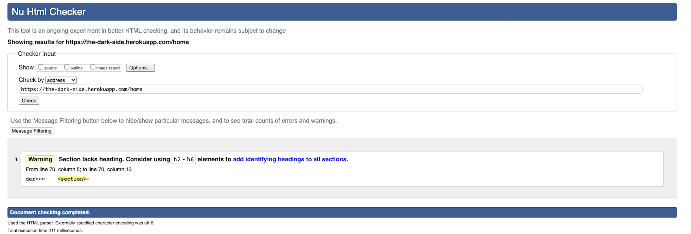

* The warning refers to the flashed messages section. This does contain a `h4` heading within a div. I added in another h4 heading which then brought up a warning about an empty heading so I decided to revert to the original code. 

* One further error was detected on both the 'add review' page and the 'edit review page'

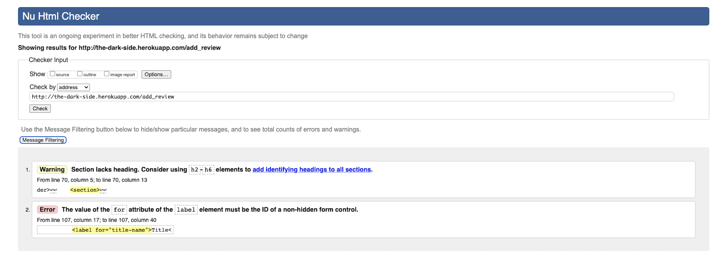

* This was a typo error where I had the input id as 'title_name' but the label for was 'title-name'. I amended this on both documents, ran the page through the checker again and the error was resolved. 

2. **CSS validated on [W3C CSS Validation Service](https://jigsaw.w3.org/css-validator/#validate_by_input)**
Checked using the 'Validate by Direct Input' method.
* Passed with no errors found, but 10 warnings were found. 

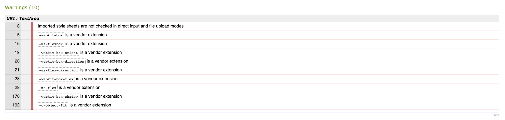

* These warnings relate to the vendor prefixes added by Autoprefixer along with one warning re the imported stylesheet, no action required. 

3. **JavaScript validated on [JSHint](https://jshint.com/)**

* Seven errors were found initially:

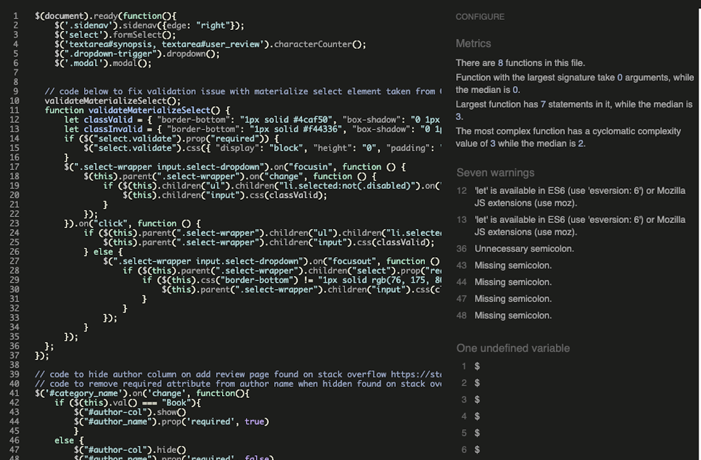

* Five of these warnings were to do with semi-colons - I amended this in my file. I found a solution in Slack to eliminate the other warnings which was to click on the 'configure' button in JSHint and check 'New Javascript features (ES6)'. I also found on Slack checking the 'jquery' button under configure would ensure the checker will recognise JQuery and so no longer describe '$' as an undefined variable. I ran the code through once more after these adjustments and it passed with no errors or warnings. 

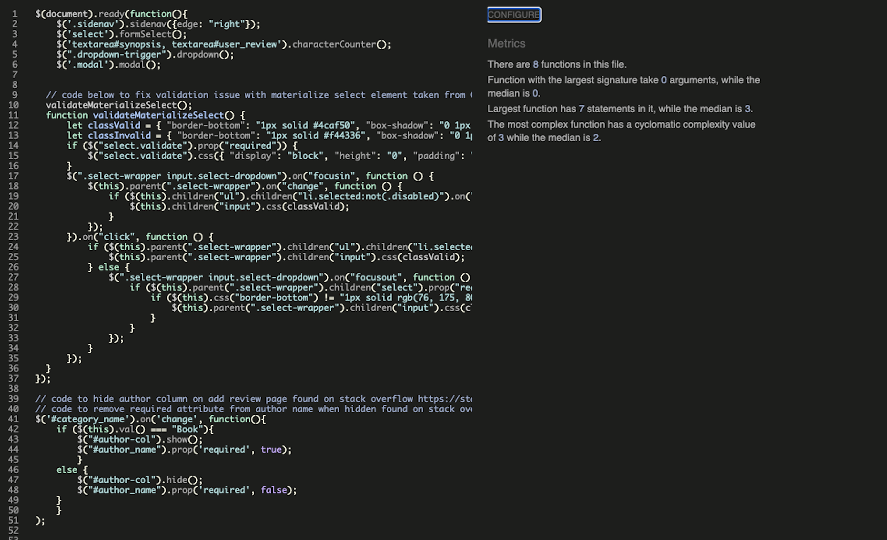

4. **Python valdiated on [PEP8 online](http://pep8online.com/)**

* No errors found

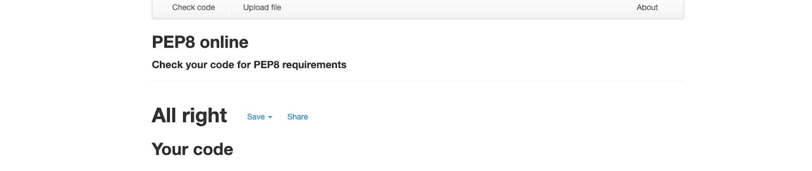

[Back to Contents](#contents)
***
## Automated Testing
___
### Lighthouse Testing

After inital lighthouse testing, I implemented some recommendations to improve scores - 
* Added `rel="opener"` to improve security and performance when opening external links (added to social media links in footer).
* Added a `title` attribute to improve accessibility for the social media links that display icons only.
* Changed the input field label text to a darker shade on 'add review' form to improve accessibility as recommended. However, the accessbility score is still less than I would like as while lighthouse shows the select dropdown as not having a label for, I do have a label associated with this.
* The performance score on mobile size for each of the review pages was disappointing low around the 72% mark. The main cause of poor performance at this size was the user uploaded images being served simply as user entered urls. After looking into ways to improve on this, I would in the future look into using a better method of serving these images, eg. by using a package such as Imagemagick or a service such as Cloudinary. Further study on these is required outside the time contraints of the project.

**Lighthouse results:**
* Home page - desktop & mobile
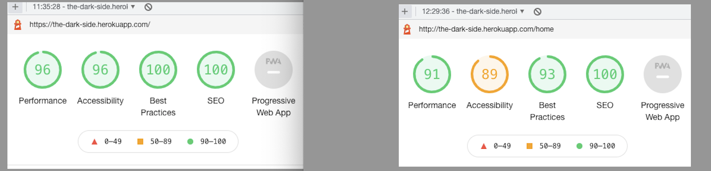

* Add review page - desktop & mobile
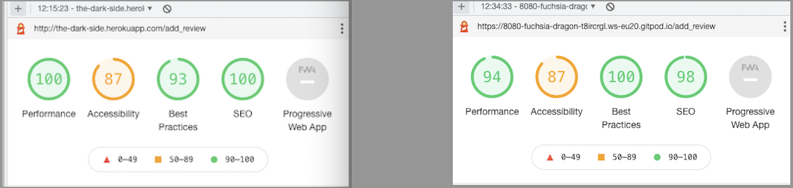

* All reviews page - desktop & mobile
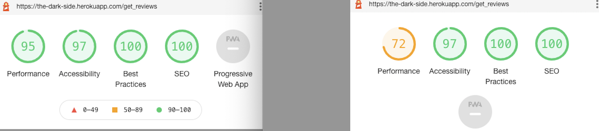

* Contact page - desktop & mobile
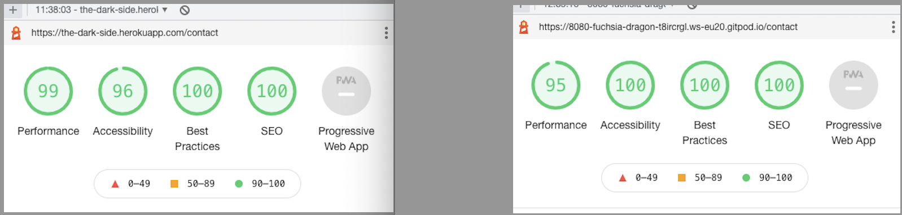

* Edit review page - desktop & mobile
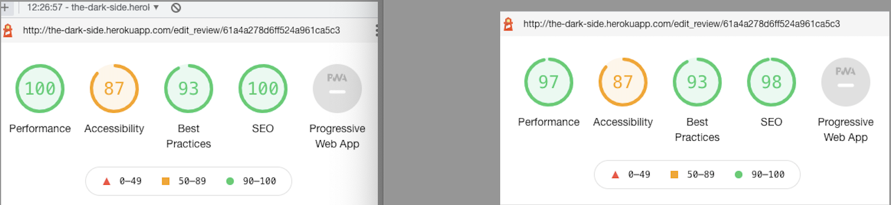

* Login page - desktop & mobile
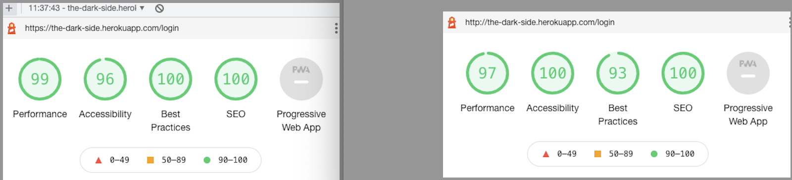

* Profile page - desktop & mobile
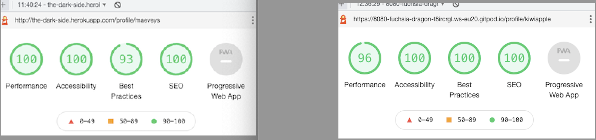

* Register - desktop & mobile
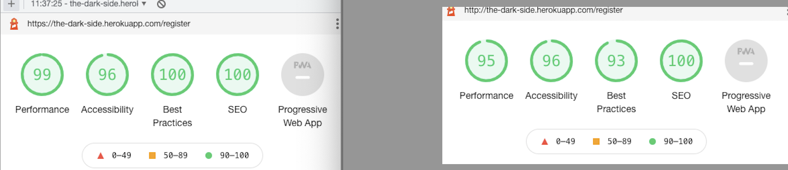

[Back to Contents](#contents)
***
## Manual Testing
___
### Functionality Testing

I used Google Chrome Dev Tools at all stage of this project to continuously check how each detail worked, particularly in ensuring responsiveness of each setion and feature as I worked on them. 

The following are the steps taken to manually test each feature of the website. 

Home Page as a non logged in user:

* Nav Bar
    + clicked on 'The Dark Side' logo at the left side of the nav bar to ensure home page loads. 
    + clicked on the 'Reviews' link to ensure dropdown menu expands as expected. Clicked on each link (Books, Movies, TV Shows, All reviews) to ensure it led me to relevant content page. 
    + clicked on the 'Home' link to ensure it returned me to home page.
    + clicked on the 'Register' link to ensure it brought me to the user registration page.
    + clicked on the 'Log In' link to ensure it loaded the user log in page.
    + clicked on the 'Contact' link to ensure it brought me to the Contact form page. 
    + all above were also checked with Navbar in the collapsible side nav state to ensure this sidenav element also functioned as expected.

* Footer
    + clicked on the 'Get in touch' link in the footer to ensure it brings user to the Contact Page.
    + clicked on each of the 3 social media links to ensure these opened in a new page and correctly brought the user to the relevent social media sites.

* Content
    + clicked on each link to ensure they function as expected:
        1. 'click here to see all reviews' link brings user to all reviews page
        2. 'Sign up now' link brings user to register page
        3. 'login page' brings user to the log in page
        4. 'Books' card link brings user to book reviews page
        5. 'Movies' card link brings user to movie reviews page
        6. 'TV shows' card link brings user to tv show reviews page

Home Page as a logged in user
* Nav Bar
    + visual check to ensure as a logged in user, the 'Register' and 'Log in links no longer display and are replaced with 'My Profile' and 'Add Review' links
    + click on 'My Profile' link to ensure is brings user to their unique profile page (this step was repeated using 3 different user logins I created)
    + click on 'Add Review' link to ensure it brings user to the add review form page
    + click on 'Log out' to ensure this logs out the current user and the nav bar links revert to original options and user is redirected to the log in page.

Books Review Page
* All of the above steps for the Navbar and Footer links were repeated to ensure all worked as expected from this page. 
* Steps repeated as a non logged in user as well as a logged in user.
    + click on each card display to ensure card is functioning as expected and content can be revealed on clicking up arrow and hidden on clicking down arrow
    + Search bar:
        1. attempt to click search button with nothing entered in search field to ensure validation works
        2. enter a word known to not provide a match to test what is returned in a no results scenario  - 'No results found' flash message displays and 'Sort-by' bar is hidden as designed. 
        3. click on 'Reset' button - returns the user to the all reviews page with all reviews on the database showing. This functions as expected.
        4. enter a word known to match a title (or titles) to ensure results are returned as expected. This functions. Tested with a title know to bring up a single match, also tested with a title that should return mulitple matches (ie. 'haunted' returns two titles as expected). Also tested to ensure search is not required to be case sensitive. 
    + Sort-By feature:
        1. click on sort by arrow to ensure dropdown functions as expected and displays two options for the user - Title A-Z, Rating
        2. click on Title A-Z to ensure this returns only all book reviews in Title alphabetical order
        3. click on Rating to ensure this returns only all book reviews in order of rating (best to worst)

Movies Review Page/TV Shows Review Page/All Reviews page

* All the above steps for the book reviews page were repeated for each of the remaining review pages which all performed as expected. 
* Sort-by feature on each page returns only results from that category ie. on Movies page, sorting only deals with Movie reviews. This functions as designed. On the reviews page, the sort-by returns all the results as expected. 

Register page
* All of the above steps for the Navbar and Footer links were repeated to ensure all worked as expected from this page. 
* Further steps taken:
    + tested username field validation by entering no characters, less characters than advised, special characters and tried registering, form validation functioned as expected and provides the user with feedback if not filled correctly
    + repeated these steps in the password field, all functions as expected. 
    + tested with entering a username known to already exist to ensure a duplicate is not accepted and a messsage is returned to user that that username already exists. 
    + tested link to log in page if user is already registered.
    + tested with creating a new user to ensure register form functions correctly and user is brought to their profile page and a success message is displayed to user, and nav links change to display correct options for a registered user

Log In Page
* Repeated all of the above steps with regard to checking validation on username and password fields 
* Further steps taken:
    + attempted to log in with a username known to not be registered already, attempted to log in with an incorrect password for an already registered account - both steps resulted in log in failing, message being displayed to user that an incorrect username and or password was used and reloading the log in form to allow user make another attempt. 
    + logged in as registered user to ensure log in accepted as expected and user brought to their profile page
    + clicked on register link to ensure user is redirected to the register page if they have not yet done so.

Contact Page
* Repeated the above steps for all the navbar and footer links and all are functioning.
* Further steps taken:
    + attempted to send message form without the name field filled in, then with incorrect email format, and with message field left blank. The basic form validation functioned as expected to ensure form could not be submitted without the fields being filled in and provided feedback to the user indicating such. 
    + filled in all fields correctly and clicked send message button to check that a message is displayed to the user indicating their message has been sent successfully. 

**Further functionality testing with a logged-in user** 

My Profile Page/Add New Review Page/Edit & Delete functions
* Repeated all above steps for navbar and footer functionality. 
* Further steps taken:
    + Log in as a user that has no reviews to ensure correct message displays along with the Add Review button, click on this, which loads the add review page, created new review to check all functioning. Redirected back to profile page as expected on completion. Review displays here with edit and delete buttons underneath. Tested both to ensure all functioning and review can be either edited or deleted. Appropriate delete warning and check displayed to the user on pressing delete, requiring user to click again to confirm. 
    Tested image verification works as expected by uploading review with 'link to image' field left blank, then with a link that did not contain an image, and finally a link to a valid image address. All functioned as expected. 
    + Logged out and logged back in as same user to ensure reviews added by that user display correctly on profile page. 
    + Tested various scenarios to prompt flash messages to make sure all feedback messages to the user display as intended. 

Admin additional functionality  
* Logged in as admin to ensure that on the reviews page, all reviews on the site show the edit and delete buttons and these function correctly. Edited a review added under another username, changes saved and without overwriting the 'added-by' field so the review is still credited to the orginal user and thus will still show on their profile page when logged in, tested this to ensure works as expected. Ensured the delete button functions correctly so the admin can delete any user reviews that might be unsuitable. 

[Back to Contents](#contents)
___

#### Responsiveness

* Checked the responsiveness of the website at every stage of development throughout the project using Chrome Dev Tools. 
* Also checked responsiveness at [Responsinator.com](https://www.responsinator.com/)

#### Cross Browser
The website was developed and tested primarily using the Chrome browser. I then checked the following browsers to ensure all worked as expected - 
+ Firefox
+ Opera
+ Safari
+ Microsoft Edge

[Back to Contents](#contents)
___
### User Stories Testing

* _As a user, I want to find a site that reviews books, movies and tv shows specifically in the horror genre._ 

The landing/home page of the website introduces the user to the aim of the site, withe the introductory paragraph clearly setting out that the website contains reviews of horror books, movies and tv shows for the horror fan in particular. 

* _As a casual user, I want to be able to navigate the site easily and read reviews to help me decide what to watch or read next, I want access to this information without having to create an account, so I can then decide if I wish to engage and add reviews of my own._

The website is simply and intuitively laid out so the user can very easily navigate throught the site and see the options. With links from the home page in the content area as well as a clear Nav bar with the various options to choose from. The casual user can browse through all the reviews and access that content with options to search for a particular title or sort reviews by title alphabetically or by best rated. They can they decide to create an account if they wish to upload their own reviews. 

* _As a frequent user, I want to be able to create a profile so that I can add reviews of my own to share with other horror fans and users of this site._

The register page is linked to from the home page, along with links in the Navbar, very clearly which brings the user to a standard registration form with a username and password field. Once they have registered, this will create their own profile page which will show any reviews they have uploaded previously. This page has a large button the user can click on to Add a new review. Once a user has registered, the links in the Navbar also adjust to provide different options so the user can easily navigate to the add review page and their profile page, or the Log out option. 

* _As a user, I want to be able to search the database easily to find any specific reviews._ 

The search bar displays at the top of each of the review pages and provides the user with info that it is a 'search by title' option with clear buttons to search or a reset button to go back to seeing all reviews. Further to that, the website has also provided the user with a 'sort-by' dropdown feature and allows the user to sort by title into alphabetical order or by ratings. 

* _As a user, I want to be able to easily log in to my account so I can see what reviews I have added previously and be able to update or delete them._

The Log In page is clearly navigable from the main home page with a link in the content paragraph as well as the Nav bar link which displays on every page. 

* _As a user, I want to be able to contact the site with any queries I may have._

The 'contact' option from the Navbar link as well as the 'Get in touch' link in the footer brings the user to the contact page where they can fill out the contact form and submit. 

* _As a user, I want to follow this site on any social media they may have._

The social media links are in the footer across all pages of the website and link to the relevant social media network which will open in a new tab. 

[Back to Contents](#contents)
___
### Bugs and Fixes

* Had problems conecting to MongoDB initially. I double checked all syntax, created new user to access the database and still was unable to solve this problem. After creating a new account, new cluster, new database and user I was able to then get it all functioning properly. 

* After adding functionality for 'admin' user to edit (and delete) all reviews regardless of who added them, I found initially the added-by field would be overwritten and the review now showed as added-by admin rather than original user and would no longer display on the user's profile page. Code Institute Tutor suggested looking in to using the `$set` operator to only update fields contained in the dict being created and then leaving out the 'added-by' field. This worked to solve the issue. 

* After adding a couple of reviews with the title name in lowercase, I found that the Sort by Title function returned the non-capitalized titles at the end, sorted only as compared to each other as opposed to being sorted together with the capitalized names. I first tried to use the .lower() method as I was sorting the results but this resulted in an error. The solutions I was finding after googling the issue seemed overly complicated but I did find out it is common of MongoDB to return sort requests in this way, and so I decided to try the .capitalize() method as the title name is being sent to Mongo Db instead. This very simple solution worked to solve this problem. Further to this, I then changed .capitalize() method to .title() after once more consulting google, as I wanted the movie or book titles to capitalize each word in the title rather than only the first.

* In using the dropdown menu feature in the navbar from materialize, I found it would only target either the main navbar or the collapsible sidenav and not both at the same time. Found an assist to a solution [here](https://pretagteam.com/question/materialize-navbar-dropdownsidebar-dropdown-wont-work-together) which suggested using two copies of the same ul, one to target main navbar, one to target collapsible side navbar. 

* Having issues using Materialize modal for confirming with user before deleting a review, issue was with targeting the correct review, solution to use the jinja templating value of the review id in the href and id found on slack (project-milestone-3 channel)

* Solve to preserve image aspect ratio and a basic resize on images for user uploaded image urls found on stack overflow [here](https://stackoverflow.com/questions/12991351/css-force-image-resize-and-keep-aspect-ratio)

* Found I had alot of repetition across 4 html files (book_reviews, movie_reviews, tvshow_reviews and reviews) so went back to look at refactoring this. Looked at the routing in app.py and I worked out a better solution of pulling the info from mongo db and returning those results on the one reviews.html page using different routes. However, I then stuggled with injecting the correct h2 header based on which route was chosen. I eventually found a solution to this on Stack Overflow [here](https://stackoverflow.com/questions/62853545/if-statement-to-determine-which-route-is-used-in-jinja-template-flask) which suggested using `request.endpoint` in the jinja `if` statement in reviews.html to execute an action (in this case displaying different headers). This worked perfectly and allowed me to delete 3 html files and control it all from one page using different routes. 
    + Following on from this, I then wanted to see if there was a start point you could specify with this method also so that I could have the sort-by functionality return results based on what url the user is on when called this function as intitially, the sort-by functionality only returned results that sorted all reviews in all 3 categories. I wanted it to function so that if the user is only looking at movie reviews, then the sorting would return only movie reviews and not all categories reviews. I found the `request.path` solution [here](https://stackoverflow.com/questions/26276580/how-to-get-current-url-in-jinja2-flask-request-url-not-working) on Stack Overflow. 
    + Then, one other issue to solve in tandem with the above was getting the correct h2 to show after the sort button was clicked on and I found the correct syntax to provide 2 checks in the jinja if statement once more on Stack Overflow [here](https://stackoverflow.com/questions/15168831/how-to-write-a-multiline-jinja-statement).

* Issue with some user uploaded links being broken so with guidance from CI tutor, found solution & function code for image verification on [Stack overflow](https://stackoverflow.com/questions/10543940/check-if-a-url-to-an-image-is-up-and-exists-in-python) and implented a generic back up image to load if link not working, or not a valid filetype or not provided. 
* During late stage testing, found some image url links that I tried to add returned a `keyerror` for content-type. I found a solution that worked for me on [Stack Overflow](https://stackoverflow.com/questions/37339644/content-type-is-blank-in-the-headers-of-some-requests), along with the following explanation - "Not all servers set a Content-Type header. Use .get() to retrieve a default if it is missing:".

* Note, I would like to in the future, outside the time restraints of the project, look at trying to refactor some of the code in app.py as the way I have the sort feature working currently seems repetitive. 

Bugs not yet fixed
* One feature I have on 'Add Review' form is to hide the 'Author' column if 'Movie' or 'TV Show' are selected in the category field as it is not relevant for those categories. I also added this to the 'Edit Review' form but found that when the page loads first, the author field shows regardless of what category is prefilled. Once you click into the category and reselect, it then is hidden (if not a book) and functions as expected. I tried various fixes for this before needing to move on with no satisfactory solution. Again, I will need to come back to this in the future and try again to find a solution. 

[Back to Contents](#contents)
___

